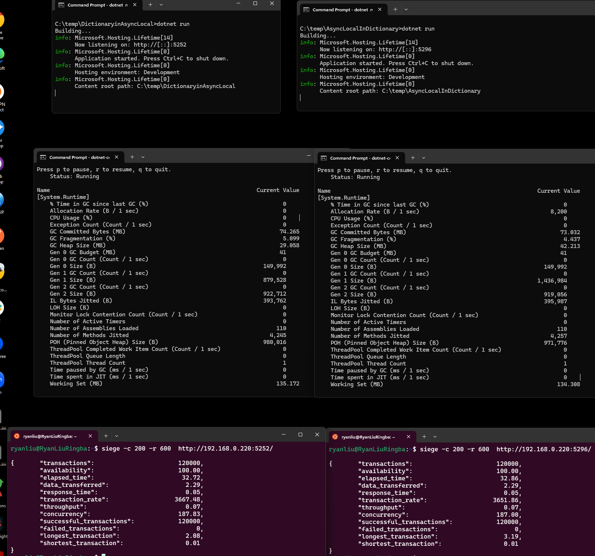
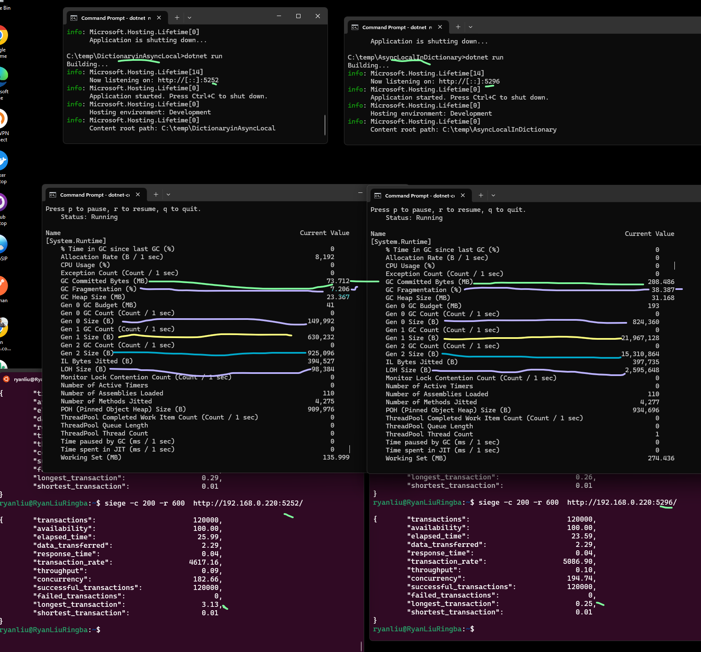
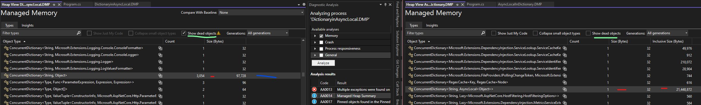
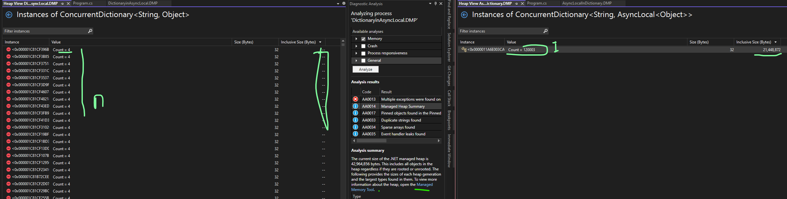

# Set up and run

> dotnet new webapi -o DictionaryinAsyncLocal

> dotnet new webapi -o AsyncLocalInDictionary


 > siege -c 200 -r 600  http://192.168.0.220:5252/    # dictionary in asyncLocal

 > siege -c 200 -r 600  http://192.168.0.220:5296/    # async local in dictonary
 
``` 
	 -c, --concurrent=NUM      CONCURRENT users, default is 10
	 -t, --time=NUMm           TIMED testing where "m" is modifier S, M, or H
								ex: --time=1H, one hour test.
	 -r, --reps=NUM              number of times to run the test.
	 -b, --benchmark           BENCHMARK: no delays between requests.
```
 
  > dotnet-counters monitor  --name DictionaryinAsyncLocal

  > dotnet-counters monitor  --name AsyncLocalInDictionary
  
  
  # Look at result:
  
  Speed (conslusion might change when even high load and GC kicked in)
    DictionaryinAsyncLocal (my version) is slightly slower than AsyncLocalInDictionary (original).  Guess creating a dictionary for each request takes a little time.

  
  ## But for memory and GC:
  
  When key is static thus just small set, two approach performance are similar. 
  
  
  
  
  
  When key is dynamic thus lot of keys added overtime: DictionaryinAsyncLocal is way way better 	

  
  
  
  
  ## Deep div to spcial case where key is dynamic (120K unique keys in dictionary )

   

Drill in :

    

  
  For AsyncLocalIndictionary old approach you can see only one instance of ConcurrentDictionary<string, AsyncLocal<object>>, but this dictioary has 120,003 keys/entries. Take 21,448,872 bytes momeory. Avg  21448872/120003 = 179 Bytes for a KeyVaulePair<string, AsyncLocal<object>>.  *** 21M momory can NOT be released. ***  
 
 ```
 8 bytes for string key refence
 72 bytes for key guid string  or smaller size for other types
 72 bytes for key guid value
 24 bytes for AsyncLocal<T>
Total is 176 bytes 


  For new approach, which dictioanry in AsyncLocal, there are 3054 ConcurrentDictonary<strong, Object> left, (others has been GCed), total size is 97728 bytes.  Avg 97728/3054 = 32 Bytes for a ConcurrentDictionary, which has 4 KeyValuePair<string, object> in it. Each take 8 bytes, just a reference size.  
  
  Even those remaing 3054 instances, they are dead objects already, ready to be GCed.

```
sizeof(object\*) which is size of a reference
8

sizeof(Guid)
16

a Guid string
36 characters * 2 bytes/character = 72 bytes

sizeof(DateTime)
8

sizeof(DateTime*)
8

```

## 
- First notice there is no way to remove an entry. But probably for a good reason. 

- 2ndly probably better use Ioc container, inject ICallContext  to wherever it is needed, instead of using a static class which can make unit test harder. When using It’s lifetime should be scoped. Then Ioc container will take care it.  Some Ioc containers indeed will use AsyncLoca to implement it. Also there is a chance to support strong typed context item value, not just object, and support context initiation and verification (e.g. from http request) and propagation (like open telemetry does), and better selectively supply data to generic logging framework.  

- If we keep the simple approach of using a static class CallContextHelper.cs like we have now, I would suggest the other way around, put ConcurrentDictionary in async local. So only one async local, but many dictionaries. This whole dictionary as async local value can be garbage collected once the execution chain is over (e.g. http response is done).  Dictionary Keys introduced in one execution will not pollute another execution, and no memory leak.  

Verse now ConcurrentDictionary COULD keep growing forever if news keys are added by different executions. The global dictionary couples otherwise unrelated execution together which is not desirable in a web server.  When execution is done, data in asyncLocal can be GCed, but “empty shell” of AsyncLocal is always there together with its key (KeyValuePair<string, AsyncLocal<obj>>), it can not be GCed since referenced by the big dictionary.   This can cause memory leak depending on usage pattern which as a library it does not dicates.  We might have a small set of keys, so the memory problem won’t be so evident. 


Another issue is there and won’t be in the new proposal.  In my new proposal Dictionary is local to  the execution, no longer shared, concurrent tension changes  from very high to almost none.  It is good for performance. In current imp, static CallContext.state ConcurrentDictionary is a global state. IMO global state is not desired unless it is const.  ConcurrentDictionary’s implementation is optimized, but fine-grained lock is still used in write operations. Global lock is an enemy of scalability, and needs to be avoided. 


```

public static class CallContext  //Optional extra layer to support different runtime and better isolation/test

{

   \#if NETFRAMEWORK  // async local works mostly in .NET framework but there are edge cases in classic ASP.NET

    private static readonly IContextDataStore ImpInstance = new DotNetFrameworkVersionDataStore();

   \#else

    private static readonly IContextDataStore ImpInstance = new ContextDataStore(); 

   \#endif

        public static void AddObject(string key, object value)
        {
            ImpInstance.AddObject(key, value);
        }

        public static object GetObject(string key)
        {
            return ImpInstance.GetObject(key);
        }

        public static T GetObject<T>(string key) where T : class
        {
            return (T)GetObject(key);
        }


        public static bool HasKey(string key)
        {
            return ImpInstance.HasKey(key);
        }

        public static bool ClearObject(string key) => ImpInstance.ClearObject(key);

}

  
  internal class ContextDataStore: IContextDataStore  // because extra layer, this no need be static, better for unit test
   {
       private readonly AsyncLocal<ConcurrentDictionary<string, object>> _asyncLocalDictionary = new();

       public void AddObject(string key, object value)
       {
           if (_asyncLocalDictionary.Value == null)
           {
               _asyncLocalDictionary.Value = new();
           }

           _asyncLocalDictionary.Value[key] = value;
       }

       public object GetObject(string key)
       {
           return _asyncLocalDictionary.Value?[key];
       }


       public bool HasKey(string key) => _asyncLocalDictionary.Value?.ContainsKey(key) ?? false;

       public bool ClearObject(string key) => _asyncLocalDictionary.Value?.TryRemove(key, out _) ?? false;
   }
``` 