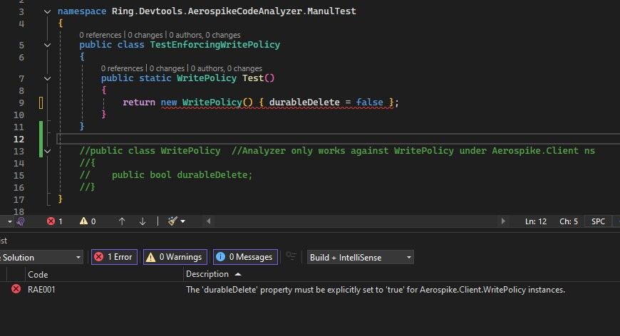
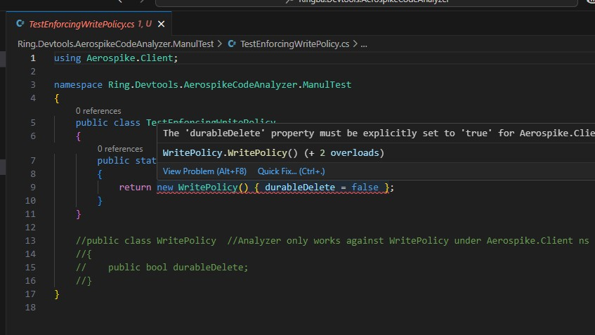
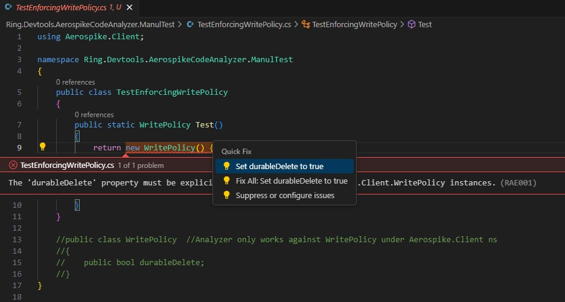

# AeroSpike Code Analyzer

This NuGet Pacakge is not be used to enforce Aerospike.Client.WritePolicy is always created with durableDelete = true. 

> For any porject that reference to Aerospike.Client, please make sure refer to this Ringba.Devtools.AerospikeCodeAnalyzer NuGet package as well.

It will generate compile error when the source code is composerd.  It can also fix all the violations in the file/project/solution wehen mouse over the error.

It works in Visual Studio Code too:

Even with this tool, please still check the code yourself when writing code or reviewing the code.

> This tool has not enforced default write policy yet.

For more infomation, please check out [Developer's guide - Aerospike durable delete](https://app.shortcut.com/ringbadevteam/write/IkRvYyI6I3V1aWQgIjY3ODZmM2NhLTQyYTEtNGQ1OC1hMjI4LTY3MDZmYzk5OTk2YSI=).
