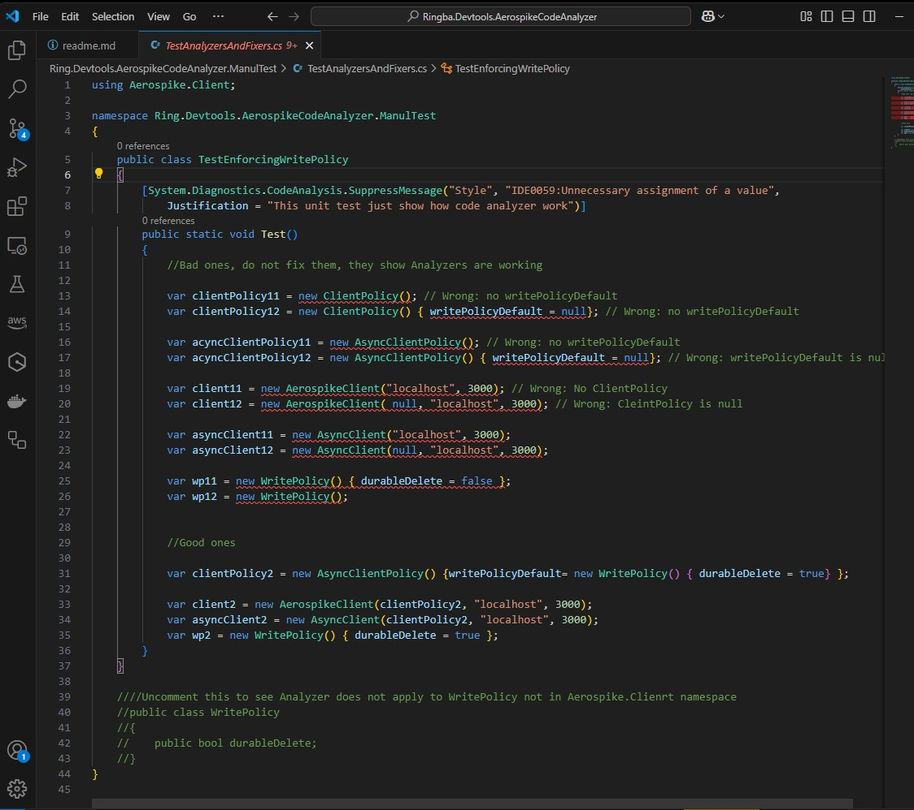

# AeroSpike Code Analyzer and Fixer

This NuGet Pacakge is not be used to enforce always use durable delete for Aerospike.

> Whenever you add reference to Aerospike.Client, please also add this Ringba.Devtools.AerospikeCodeAnalyzer NuGet package at the same time!!!

And it is all need to be done. No need call this NuGet package from code.  But you might close and re-open Visual Studio or Visual Studio Code.

Then it will generate compile error when the source code is composed/compiled.  It can also fix all the violations in the scope of file/project/solution wehen moving mouse over the error.


It works in Visual Studio Code too:




Even with this tool, please still check the code yourself when writing code or reviewing the code.

It works for both .NET framework and .NET Core/.NET apps/libs.

# Background

To make sure deleted records will not come back to life when restart Aerospike server, https://app.shortcut.com/ringbadevteam/story/21019/enable-durable-delete-for-aerospike is deployed to enable durable delete.

Key to its success is from now on, we will never write to Aerospike without the WritePolicy's durableDelete set to true. Here I say `write` instead of `delete` because `delete` can happen in multiple ways, can be

- A call Delete();
- Put null to all or last bin;
- Call to Operation;
- Call to Lua script.

Thus why durableDelete is in WritePolicy.

WritePolicy is provided in 2 ways:
1. Explicit created and pass to each AE write call;
1. Default from AerospikeClient's clientPolicy/writePolicyDefault or AsyncClient's AsyncClientPolicy.writePolicyDefault if WritePolicy is not provided or null.   `(new version has more related defaults)`

So to ensure we always have durableDelete set to true, we need


1. When "new" a WritePolicy, always initialize it with `durableDelete = true`;
1. When create a connection to Aerospike, always create them with the constructor that takes ClientPolicy or AsyncClientPolicy. Specify its writePolicyDefault to the instance has `durableDelete = true`.  Try to use this class [DefaultPolicies](https://github.com/Ringba/Ringba-v2/blob/ccc67a659fc5df0970c89500eb7ffaf676502957/Ringba.Infrastructure.Aerospike/DefaultPolicies.cs) as much as possible;
1. When the time to upgrade to newer version Aerospike client lib, make sure check additional write/delete related policies beyond writePolicyDefault  like  `batchWritePolicyDefault` etc;
1. Do this for both AsyncClient  and  AerospikeClient (later one should be phasing out);
1. Utilize [PolicyExtensions](https://github.com/Ringba/Ringba-v2/blob/ccc67a659fc5df0970c89500eb7ffaf676502957/Ringba.Infrastructure.Aerospike/PolicyExtensions.cs)'s extension method `EnsureDurableDelete(this WritePolicy policy)`, as our Ringba.Infrastructure.RetyClient and RetryClientAsync do.

This NuGet package is for rule 1 and 2.

Examples can be found in https://github.com/Ringba/Ringba-v2/pull/3938/commits for the first 4 commits. 


> It is very hard to get rid of stale data from AE server.  Brian needs to replace AE nodes one by one. 
So make sure not re-introduce stale data back by always using a writePolicy with durableDelete=true. 


When write new code or doing code review, please keep these in mind.  Thanks!

    
```
public static class DefaultPolicies
    {
        private static readonly WritePolicy _durableDeleteWritePolicy 

          = new WritePolicy() { durableDelete = true };

        public static readonly ClientPolicy DurableDeleteClientPolicy = 
           new ClientPolicy() { writePolicyDefault = _durableDeleteWritePolicy };

        public static readonly AsyncClientPolicy DurableDeleteAsyncClientPolicy = 
           new AsyncClientPolicy() { writePolicyDefault = _durableDeleteWritePolicy };
    }


new Aerospike.Client.AsyncClient(
    DefaultPolicies.DurableDeleteAsyncClientPolicy, 
    Configuration["aerospike:address"], 3000
)
```

For more infomation, please check out [Developer's guide - Aerospike durable delete](https://app.shortcut.com/ringbadevteam/write/IkRvYyI6I3V1aWQgIjY3ODZmM2NhLTQyYTEtNGQ1OC1hMjI4LTY3MDZmYzk5OTk2YSI=).

